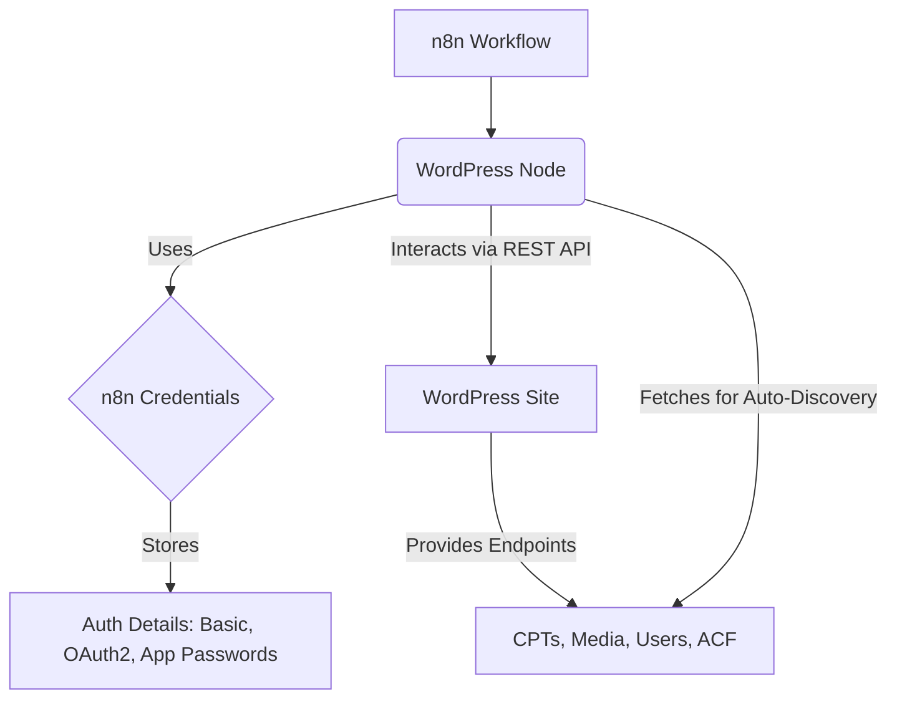

# System Patterns: Enhanced n8n WordPress Node

## 1. System Architecture
The node will be a TypeScript-based n8n node, adhering to the standard n8n node architecture.
- **Node Definition (`WordPress.node.ts`):** Contains the main logic, properties, and methods for the node.
- **Credentials:** Leverages n8n's credential management for storing and handling WordPress authentication details (Basic Auth, OAuth2, Application Passwords).
- **API Interaction:** Utilizes the WordPress REST API for all communications with the WordPress site.
- **Dynamic Parameters:** Implements n8n's dynamic parameter capabilities for auto-discovery features (e.g., listing CPTs, ACF fields).

## 2. Key Technical Decisions
- **Language:** TypeScript (consistent with n8n core and node development).
- **API Client:** A dedicated API client/service within the node to handle requests, responses, error handling, and retry logic for the WordPress REST API. This promotes separation of concerns and reusability.
- **Modularity:** Structure the node code to separate concerns: authentication, resource operations (posts, media, users), ACF handling, and utility functions.
- **State Management:** Primarily stateless, relying on n8n's execution context. Any temporary state for multi-step operations (if needed) will be managed carefully.

## 3. Design Patterns
- **Service/Repository Pattern:** For abstracting WordPress API interactions.
- **Strategy Pattern:** Potentially for handling different authentication methods or different versions of the WordPress API if significant variations exist.
- **Adapter Pattern:** To map data between n8n's internal data structures and the WordPress API's expected request/response formats.

## 4. Component Relationships
- **`WordPress.node.ts`:** Orchestrates all operations.
- **`WordPressApi.service.ts` (or similar):** Handles all direct communication with the WordPress REST API.
- **Credential Type Definition:** Defines the structure for storing WordPress credentials in n8n.
- **Helper/Utility Functions:** For common tasks like data transformation, URL building, etc.

## 5. Critical Implementation Paths
- **Authentication Flow:** Ensuring secure and reliable connection establishment for all supported methods.
- **Auto-Discovery Mechanism:** Efficiently querying WordPress for CPTs and ACF fields and presenting them as dynamic options in the n8n UI.
- **ACF Field Mapping:** Robustly handling various ACF field types and nested structures, allowing users to map them to n8n data.
- **Error Handling and Retry Logic:** Implementing a consistent and effective strategy for managing API errors and transient issues.
